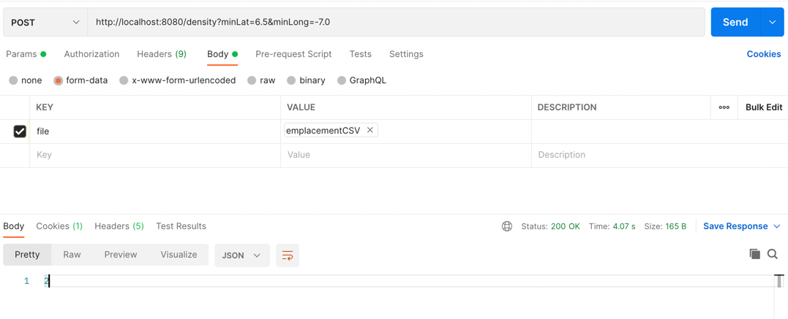
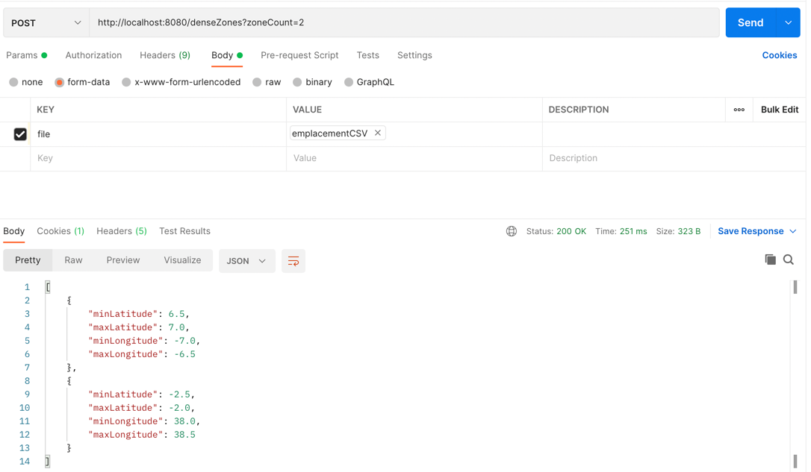

# Building the application
mvn clean install

# Lanching the application
mvn spring-boot:run

# Testing the application
- Open Postman

- Create a new http request with POST as method

- In the body, select "form-data" and choose csv file
  (No need to specify content-type Postman will automatically generate it)

- To calculate density : http://localhost:8080/density?minLat=6.5&minLong=-7.0
  

- To get most dense zones : http://localhost:8080/denseZones/2
